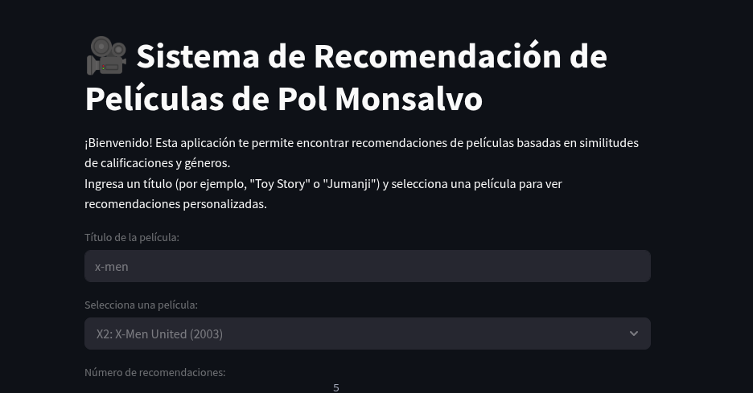

# Sistema de Recomendación de Películas 🎥



Este proyecto es un sistema de recomendación de películas que utiliza filtrado colaborativo y análisis de géneros para sugerir películas similares basadas en calificaciones de usuarios. Fue desarrollado como un proyecto para un portafolio profesional, mostrando habilidades en **Python**, **Pandas**, **Streamlit**, y análisis de datos.

## Características
- **Recomendaciones personalizadas**: Usa correlación de Pearson para encontrar películas similares basadas en calificaciones de usuarios.
- **Filtrado por géneros**: Prioriza géneros relevantes (como "Children" y "Fantasy" para películas como Jumanji) para recomendaciones más precisas.
- **Interfaz web interactiva**: Desarrollada con Streamlit, permite a los usuarios buscar películas y ver recomendaciones en una tabla clara.
- **Búsqueda avanzada**: Soporta búsqueda parcial de títulos y un menú desplegable para seleccionar entre coincidencias.

## Tecnologías utilizadas
- **Python 3.10**: Lenguaje principal del proyecto.
- **Pandas**: Para manipulación y análisis de datos.
- **Streamlit**: Para crear la interfaz web interactiva.
- **MovieLens Dataset**: Conjunto de datos pequeño (~100k calificaciones) para entrenar el sistema de recomendación.

## Instalación
1. Clona este repositorio:
   ```bash
   git clone <URL_DEL_REPOSITORIO>
   cd movie-recommender

### Crea y activa un entorno virtual:
bash

Copy
python3 -m venv venv
source venv/bin/activate
Instala las dependencias:
bash

Copy
pip install pandas streamlit
Descarga el dataset MovieLens pequeño:
bash

Copy
wget http://files.grouplens.org/datasets/movielens/ml-latest-small.zip
unzip ml-latest-small.zip
Ejecuta la aplicación:
bash

Copy
streamlit run app_1.py
Abre tu navegador en http://localhost:8501 para usar la aplicación.
Uso
Ingresa el nombre de una película (por ejemplo, "Jumanji" o "Toy Story") en el campo de texto.
Selecciona una película del menú desplegable si hay múltiples coincidencias.
Ajusta el número de recomendaciones con el deslizador.
Haz clic en "Obtener recomendaciones" para ver los resultados.
Ejemplo
Entrada: "Jumanji"
Selección: Jumanji (1995)
Salida:
Géneros: Adventure, Children, Fantasy
Géneros prioritarios usados: Children, Fantasy
Recomendaciones:
text
                                   correlation  common_users
Toy Story (1995)                              Adventure|Animation|Children|Comedy|Fantasy  0.612        68
Pirates of the Caribbean: The Curse...        Action|Adventure|Comedy|Fantasy            0.535        65
Despliegue (Opcional)
Este proyecto puede desplegarse en Streamlit Community Cloud para que otros puedan probarlo online. Sigue estos pasos:

Crea una cuenta en Streamlit Community Cloud.
Sube este repositorio a GitHub.
Conecta tu repositorio a...

### Crea y activa un entorno virtual:
bash

Copy
python3 -m venv venv
source venv/bin/activate
Instala las dependencias:

pip install pandas streamlit
Descarga el dataset MovieLens pequeño:

wget http://files.grouplens.org/datasets/movielens/ml-latest-small.zip
unzip ml-latest-small.zip
Ejecuta la aplicación:

streamlit run app_1.py
Abre tu navegador en http://localhost:8501 para usar la aplicación.
Uso
Ingresa el nombre de una película (por ejemplo, "Jumanji" o "Toy Story") en el campo de texto.
Selecciona una película del menú desplegable si hay múltiples coincidencias.
Ajusta el número de recomendaciones con el deslizador.
Haz clic en "Obtener recomendaciones" para ver los resultados.
Ejemplo
Entrada: "Jumanji"
Selección: Jumanji (1995)
Salida:
Géneros: Adventure, Children, Fantasy
Géneros prioritarios usados: Children, Fantasy
Recomendaciones:
text

                                  correlation  common_users
Toy Story (1995)                              Adventure|Animation|Children|Comedy|Fantasy  0.612        68
Pirates of the Caribbean: The Curse...        Action|Adventure|Comedy|Fantasy            0.535        65
Despliegue (Opcional)
Este proyecto puede desplegarse en Streamlit Community Cloud para que otros puedan probarlo online. Sigue estos pasos:

Crea una cuenta en Streamlit Community Cloud.
Sube este repositorio a GitHub.
Conecta tu repositorio a

## Probar la interfaz con diferentes géneros:
# Acción/Thriller: Ingresa "Rambo" y selecciona "Rambo: First Blood Part II (1985)".
Deberías ver recomendaciones como "First Blood (1982)" o "Die Hard (1988)" (Action/Thriller).

# Horror: Ingresa "Scream" y selecciona "Scream (1996)".
Géneros: Horror, Mystery
Deberías ver recomendaciones como "Scream 2 (1997)" o "I Know What You Did Last Summer (1997)".

# Drama: Ingresa "Forrest Gump".
Géneros: Drama, Romance
Deberías ver recomendaciones como "The Shawshank Redemption (1994)" (Drama).
# Romance: Ingresa "Titanic".
Géneros: Drama, Romance
Deberías ver recomendaciones como "The Notebook (2004)" (Romance, Drama).

# Caso límite: Ingresa una película con géneros poco comunes, como "Alien" (Horror, Sci-Fi).
Deberías ver recomendaciones como "Aliens (1986)" o "Terminator, The (1984)" (Sci-Fi).